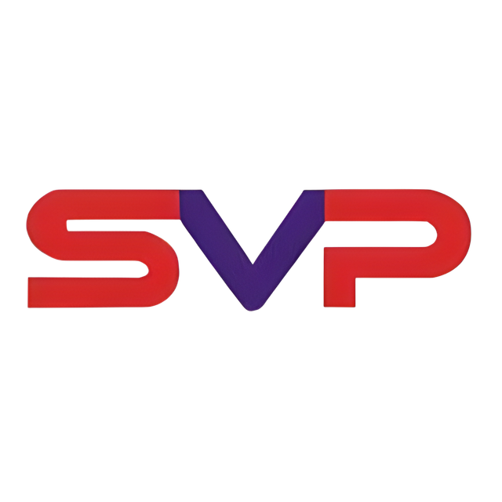

<p align="center">
  
</p>

# SVP Tech Management System

A comprehensive, role-based management system designed for **SVP Technologies**, a professional laptop repair and service center. This application streamlines the entire repair workflow from job intake to invoicing, inventory tracking, and customer management.


---

## 🚀 Key Features

### 🛠 Repair Job Management
- **Complete Workflow**: Track jobs from `Pending` -> `In Progress` -> `Waiting for Parts` -> `Completed` -> `Delivered`.
- **Job Wizard**: Easy-to-use form for creating new jobs with inline customer creation.
- **Job Financials**: Automatic calculation of parts cost + labor = total profit.
- **Custom Job Numbers**: Auto-generated, professional IDs (e.g., `PWCRJ-24-001`).

### 👥 Role-Based Access Control
- **Admin**: Full access to Financials, Technician Management, and System Settings.
- **Technicians**: Focused view on assigned jobs, status updates, and work notes.

### 📦 Inventory & Suppliers
- **Parts Tracking**: Manage stock levels, cost prices, and selling prices.
- **Low Stock Alerts**: Visual indicators when parts are running low.
- **Supplier Database**: Keep track of vendors and part sources.

### 📊 Dashboard & Analytics
- **Live Stats**: Daily/Monthly job counts, revenue, and active repairs.
- **Performance Tracking**: Technician performance scores based on job completion.
- **Financial Overview**: Profit & Loss visualization.

### 🎨 Modern UI/UX
- **Responsive Design**: Fully optimized for Desktop, Tablet, and Mobile.
- **Themes**: Built-in **Light** and **Dark** mode support.
- **Glassmorphism**: Modern, clean aesthetic with glass-effect cards and overlays.

---

## 💻 Technology Stack

- **Framework**: [Laravel 10](https://laravel.com)
- **Database**: MySQL 8.0
- **Frontend**: Blade Templates, Vanilla CSS (Custom Design System), Alpine.js
- **Icons**: Font Awesome 6
- **Server**: Apache/Nginx (via XAMPP/Laragon or Artisan Serve)

---

## 🛠 Installation & Setup

### Prerequisites
- PHP >= 8.1
- Composer
- MySQL

### Steps

1.  **Clone the Repository**
    ```bash
    git clone https://github.com/Dilshan-Mindika/svp-tech.git
    cd svp-tech
    ```

2.  **Install Dependencies**
    ```bash
    composer install
    ```

3.  **Environment Setup**
    Copy the example env file and configure your database credentials:
    ```bash
    cp .env.example .env
    ```
    Update `.env`:
    ```ini
    DB_DATABASE=svp_tech_db
    DB_USERNAME=root
    DB_PASSWORD=
    ```

4.  **Generate Key**
    ```bash
    php artisan key:generate
    ```

5.  **Run Migrations & Seeders**
    This will set up the database and create the initial Admin account.
    ```bash
    php artisan migrate:fresh --seed
    ```

6.  **Start the Server**
    ```bash
    php artisan serve
    ```
    Visit `http://127.0.0.1:8000` in your browser.

---

## 🔐 Default Credentials

**Admin Account** (Created by Seeder):
- **Email**: `admin@svptech.com`
- **Password**: ``

---

## 📱 Screenshots

### Dashboard (Dark Mode)


### Repair Job Management


*(Note: Add actual screenshots to `public/images/screenshots/` for this section to populate)*

---

## 📂 Project Structure

- `app/Models` - Eloquent models (RepairJob, Customer, Part, etc.)
- `app/Http/Controllers` - Logic for handling requests.
- `database/migrations` - Schema definitions.
- `resources/views` - Blade templates for the UI.
- `public/css/style.css` - Core design system and global styles.

---

## 📄 License

This project is open-sourced software licensed under the [MIT license](https://opensource.org/licenses/MIT).

---

&copy; 2026 SVP Technologies. All Rights Reserved.
