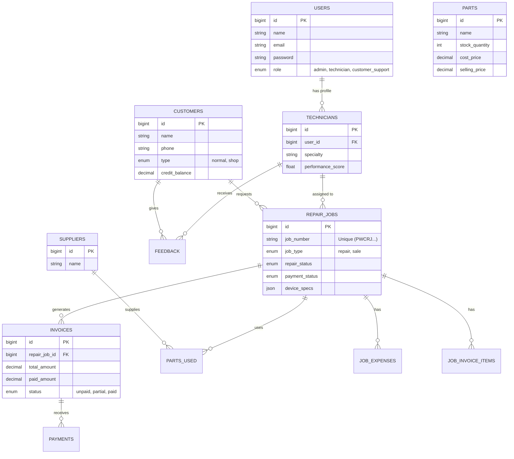

# Database Schema Documentation

This document outlines the current database schema for the SVP Tech application, based on the analysis of migration files in `database/migrations`.

## Entity Relationship Diagram (ERD)

## Detailed Table Definitions

### `users`
| Column | Type | Details |
| :--- | :--- | :--- |
| `id` | bigint | Primary Key |
| `name` | string | |
| `email` | string | Unique |
| `password` | string | |
| `role` | enum | `admin`, `technician`, `customer_support` (Default: `technician`) |
| `phone` | string | Nullable |
| `softDeletes` | timestamp | |
| `timestamps` | timestamp | |

### `technicians`
| Column | Type | Details |
| :--- | :--- | :--- |
| `id` | bigint | Primary Key |
| `user_id` | bigint | FK to `users` |
| `specialty` | string | Nullable |
| `total_jobs` | integer | Default: 0 |
| `performance_score` | float | Default: 0 |
| `softDeletes` | timestamp | |

### `customers`
| Column | Type | Details |
| :--- | :--- | :--- |
| `id` | bigint | Primary Key |
| `name` | string | Indexed |
| `email` | string | Nullable |
| `phone` | string | Nullable, Indexed |
| `address` | text | Nullable |
| `type` | enum | `normal`, `shop` (Default: `normal`) |
| `credit_balance` | decimal | Default: 0.00 |
| `softDeletes` | timestamp | |

### `repair_jobs`
| Column | Type | Details |
| :--- | :--- | :--- |
| `id` | bigint | Primary Key |
| `job_number` | string | Unique (e.g. `PWCRJ000001`) |
| `customer_id` | bigint | FK to `customers` |
| `technician_id` | bigint | FK to `technicians` (Nullable) |
| `job_type` | enum | `repair`, `sale` (Default: `repair`) |
| `repair_status` | enum | `pending`, `in_progress`, `waiting_for_parts`, `completed`, `delivered`, `cancelled` |
| `payment_status` | enum | `pending`, `partial`, `paid` |
| `laptop_brand` | string | Nullable |
| `laptop_model` | string | Nullable |
| `serial_number` | string | Nullable |
| `device_specs` | json | Nullable |
| `fault_description` | text | Nullable |
| `invoice_generated` | boolean | Default: `false` |
| `parts_used_cost` | decimal | |
| `labor_cost` | decimal | |
| `final_price` | decimal | |
| `completed_at` | timestamp | Nullable |
| `delivered_at` | timestamp | Nullable |
| `softDeletes` | timestamp | |

### `invoices`
| Column | Type | Details |
| :--- | :--- | :--- |
| `id` | bigint | Primary Key |
| `repair_job_id` | bigint | FK to `repair_jobs` |
| `invoice_type` | enum | `job`, `service` |
| `status` | enum | `unpaid`, `partial`, `paid` |
| `total_amount` | decimal | |
| `paid_amount` | decimal | Default: 0.00 |
| `parts_cost` | decimal | |
| `profit_margin` | decimal | |
| `softDeletes` | timestamp | |

### `payments`
| Column | Type | Details |
| :--- | :--- | :--- |
| `id` | bigint | Primary Key |
| `invoice_id` | bigint | FK to `invoices` |
| `amount` | decimal | |
| `payment_date` | date | |
| `payment_method` | enum | `cash`, `card`, `bank_transfer`, `cheque` |
| `reference_number` | string | Nullable |

### `parts`
| Column | Type | Details |
| :--- | :--- | :--- |
| `id` | bigint | Primary Key |
| `name` | string | Indexed |
| `stock_quantity` | integer | Default: 0 |
| `low_stock_threshold`| integer | Default: 5 |
| `cost_price` | decimal | |
| `selling_price` | decimal | |
| `softDeletes` | timestamp | |

### `parts_used`
| Column | Type | Details |
| :--- | :--- | :--- |
| `id` | bigint | Primary Key |
| `repair_job_id` | bigint | FK to `repair_jobs` |
| `supplier_id` | bigint | FK to `suppliers` |
| `part_name` | string | |
| `part_cost` | decimal | |
| `quantity_used` | integer | Default: 1 |

### `job_invoice_items`
| Column | Type | Details |
| :--- | :--- | :--- |
| `id` | bigint | Primary Key |
| `repair_job_id` | bigint | FK to `repair_jobs` |
| `description` | string | |
| `quantity` | integer | |
| `amount` | decimal | |
| `unit_cost` | decimal | |

